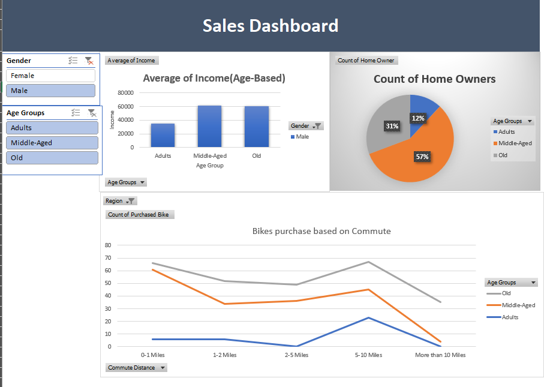

# Bike Buyers Data Cleaning and Dashboard Creation

## Overview
This project involves cleaning and analyzing a dataset of bike buyers using Microsoft Excel. The analysis included data cleaning, creating Pivot Tables for summarization, and designing an interactive dashboard to visualize key insights about the data.

## Steps Taken
### 1. Data Cleaning
- **Duplicate Removal**: Identified and removed duplicate records from the dataset.
- **Handling Missing Values**: Filled in missing data for critical columns based on logical assumptions or averages.
- **Formatting**: Standardized date formats, fixed inconsistent text entries, and ensured numerical data was correctly formatted.
- **Validation**: Ensured data integrity by checking for outliers and correcting them.

### 2. Dashboard Creation
- Designed a visually appealing dashboard with:
  - Bar charts showing buyer demographics.
  - Slicers for filtering data by region, gender, and age-groups.
  - A summary table of key metrics (e.g., total buyers, average income, etc.).

## Project Highlights
- **Tools Used**: Microsoft Excel (Pivot Tables, Slicers, Conditional Formatting, Charts).
- **Key Metrics**:
  - Identified that buyers with higher income were more likely to purchase bikes.
  - Observed trends in buyer preferences based on commute distance and education.
  - Enabled dynamic filtering with slicers for quick insight generation.

## Files in the Repository
- **`bike_buyers_RawDataset.xlsx`**: The raw dataset before cleaning.
- **`bike_buyers cleaned dataset.xlsx`**: The dataset after cleaning and formatting.
- **`Excel Project Dataset.xlsx`**: The final dashboard file with Pivot Tables and visualizations.

## Screenshot of the Final Dashboard

